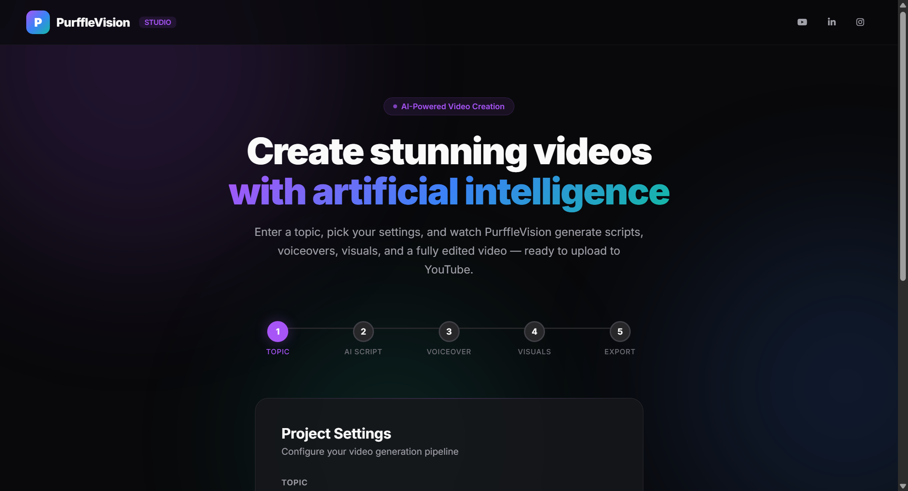

<div align="center">

# PurffleVision — AI Video Creation Studio

**Generate professional YouTube videos from a single topic using AI-powered scripts, voiceovers, stock footage, and automated editing.**

[](https://python.org)
[](https://flask.palletsprojects.com)
[](https://openai.com)
[](LICENSE)

[Features](#-features) · [Screenshots](#-screenshots) · [Quick Start](#-quick-start) · [How It Works](#-how-it-works) · [Tech Stack](#%EF%B8%8F-tech-stack)

</div>

<div align="center">

### ⭐ Star this repo if you find it useful — it really helps! &nbsp;·&nbsp; 🌐 [**Live page → purffle.com/purffle-vision**](https://purffle.com/purffle-vision/)

</div>


---

## 📸 Screenshots

<div align="center">



*Dark-themed UI with glass morphism design, animated gradient orbs, and a 5-step video generation pipeline*

</div>

---

## 🎬 What is PurffleVision?

PurffleVision is an **AI-powered video creation platform** that turns any topic into a fully produced video. Built with Python and Flask, it automates the entire video production workflow — from scriptwriting to final render.

Ideal for **content creators**, **YouTubers**, **digital marketers**, and anyone who wants to produce professional video content at scale without manual editing.

---

## 🔄 How It Works

```
Topic → AI Script → Voice Synthesis → Stock Footage / AI Images → Video Assembly → Export / Upload
```

| Step | What Happens | Technology |
|------|-------------|------------|
| 1. **Script** | GPT writes an engaging, retention-optimized video script | OpenAI API |
| 2. **Voiceover** | Text-to-speech in 50+ languages | Google TTS (gTTS) |
| 3. **Visuals** | Fetches matching stock videos or generates AI images | Pexels API / DALL-E |
| 4. **Assembly** | Composites footage, adds subtitles, overlays audio | MoviePy + ImageMagick |
| 5. **Export** | Renders final MP4, optional direct YouTube upload | YouTube Data API v3 |

---

## ✨ Features

| Feature | Description |
|---------|-------------|
| **One-click generation** | Enter a topic, click Generate, get a complete video |
| **50+ languages** | Voiceovers in English, Spanish, Hindi, Japanese, and more |
| **Dual visual modes** | Stock footage (Pexels) or AI-generated images (DALL-E) |
| **Animated subtitles** | Word-wrapped, fade-animated captions synced to voiceover |
| **YouTube upload** | OAuth 2.0 integration for direct channel publishing |
| **Modern dark UI** | Glass morphism cards, animated orbs, responsive design |
| **Smart validation** | Clear error messages when API keys aren't configured |

---

## 🚀 Quick Start

### Prerequisites

- Python 3.9+
- [ImageMagick](https://imagemagick.org/script/download.php) installed
- API keys: [OpenAI](https://platform.openai.com/api-keys) + [Pexels](https://www.pexels.com/api/)

### Install & Run

```bash
# Clone
git clone https://github.com/Chamanrajragu/purffle-vision.git
cd purffle-vision

# Setup
python -m venv venv
source venv/bin/activate  # Windows: venv\Scripts\activate
pip install -r requirements.txt

# Configure
cp .env.example .env
# Edit .env → add your OPENAI_API_KEY and PEXELS_API_KEY

# Run
python app.py
```

Open **http://localhost:5000** in your browser.

---

## 🔑 Environment Variables

| Variable | Required | Description |
|----------|:--------:|-------------|
| `OPENAI_API_KEY` | ✅ | OpenAI API key for script generation + DALL-E |
| `PEXELS_API_KEY` | ✅ | Pexels API key for stock video footage |

---

## 🏗️ Tech Stack

| Layer | Technology |
|-------|-----------|
| **Backend** | Python 3.9+, Flask |
| **AI Engine** | OpenAI GPT, DALL-E |
| **Voice** | Google Text-to-Speech (gTTS) |
| **Video** | MoviePy, ImageMagick, Pillow |
| **Media** | Pexels API |
| **Upload** | YouTube Data API v3, Google OAuth 2.0 |
| **Frontend** | Custom CSS, Inter font, glass morphism |

---

## 📁 Project Structure

```
purffle-vision/
├── app.py                 # Flask app + video generation pipeline
├── templates/
│   └── index.html         # Modern dark-themed UI
├── static/
│   ├── uploads/           # Generated videos served here
│   └── brand/             # Purffle branding assets
├── screenshots/           # README screenshots
├── requirements.txt       # Python dependencies
├── .env.example           # API key template
└── output_videos/         # Raw generated videos
```

---

## ⚠️ Disclaimer

> This is an open-source video creation tool for educational and creative purposes. Requires your own API keys. AI-generated content should be reviewed before publishing. Not affiliated with YouTube, OpenAI, or Pexels.

---

<div align="center">

**Built by [Chaman Raj](https://github.com/Chamanrajragu)**

Part of the **Purffle** ecosystem — PurffleTools · PurffleAI · [Purffle.com](https://purffle.com)

</div>


---

<!-- purffle-ecosystem -->
## 🧩 The Purffle toolset

**PurffleVision** is part of **[Purffle](https://purffle.com)** — a growing set of free, open-source tools built in the open. **If this saved you time, please drop a ⭐ — it genuinely helps the project reach more people!**

| Tool | What it does |
|------|--------------|
| 🎵 **[PurffleGrab](https://github.com/Chamanrajragu/purffle-grab)** | Free Spotify & YouTube downloader — MP3, MP4, 4K |
| 🎥 **[PurffleVision](https://github.com/Chamanrajragu/purffle-vision)** 👈 | AI video creation — any topic to a finished video |
| ⚡ **[PurffleShorts](https://github.com/Chamanrajragu/purffle-shorts)** | Autonomous YouTube Shorts generator |
| 📈 **[PurffleTrader](https://github.com/Chamanrajragu/purffle-trader)** | Crypto paper-trading bot — Binance, EMA + RSI |
| 🤖 **[PurffleCopyBot](https://github.com/Chamanrajragu/purffle-copybot)** | Copy-trading bot — mirror top Hyperliquid traders |

<sub>🌐 [purffle.com](https://purffle.com) · 💼 by [Chaman Raj](https://github.com/Chamanrajragu) · ⭐ Star to support open-source</sub>

<sub>Keywords: ai video generator, text to video, automated youtube videos, gpt video maker, faceless youtube</sub>
